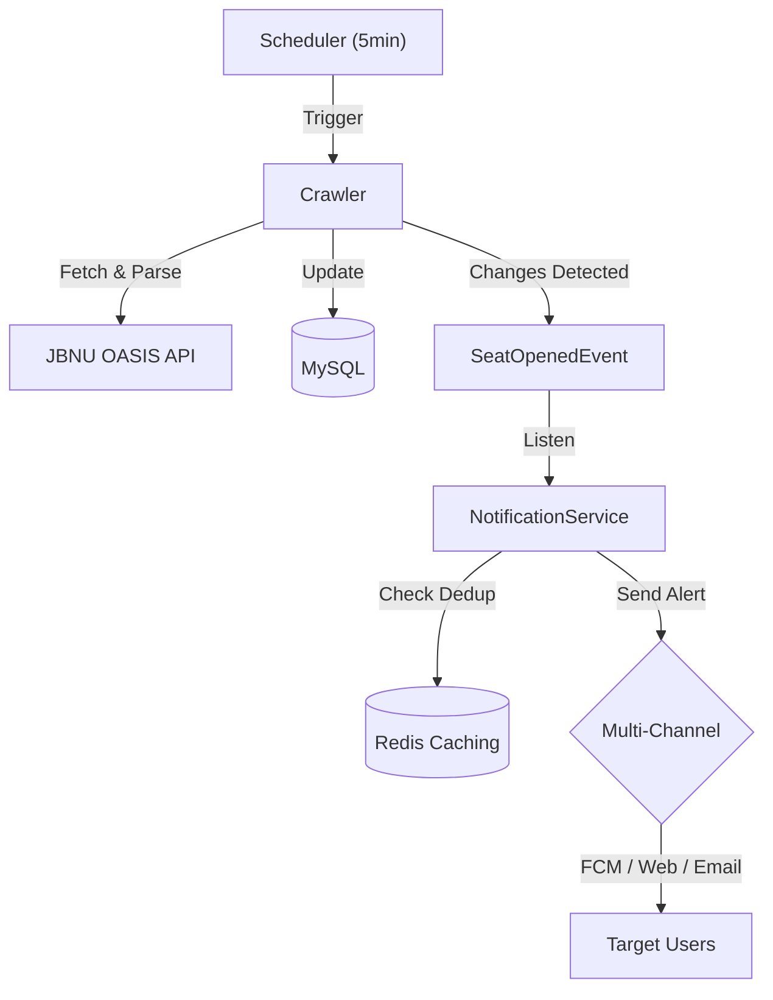

# JBNU 수강신청 빈자리 알림 (Sugang Helper)


> **"수강신청 빈자리, 이제 알림으로 확인하세요."**
> 전북대학교 수강신청 시스템을 모니터링하여 여석 발생 시 멀티 채널(FCM, Web, Email)로 알림을 전송하는 서비스입니다.

---

## 📖 프로젝트 개요 (Overview)

수강신청 기간의 반복적인 수동 조회 과정을 자동화합니다. 강의 데이터를 주기적으로 확인하여 **여석 발생(0 -> 1+)** 시점을 감지하고 알림을 보냅니다. 대규모 알림 발송 시의 성능 최적화와 Redis를 이용한 중복 알림 방지를 핵심적으로 구현했습니다.

---

## 🏗 아키텍처 (Architecture)



---

## 🚀 트러블슈팅 (Troubleshooting)

핵심적인 기술적 도전과 해결 과정입니다. 상세 내용은 [Troubleshooting Log](docs/troubleshooting.md)에서 확인할 수 있습니다.

### 1. 401 Unauthorized 및 세션 안정화

- **문제**: JWT 만료 시점(30분)과 서버 세션 타임아웃 불일치로 인한 빈번한 로그아웃 발생.
- **해결**: 세션 타임아웃 및 JWT 만료 시간을 **2시간**으로 연장하고, 토큰 재발급(`reissue`) 시 서버 사이드 세션 속성(`ACCESS_TOKEN`)을 즉시 갱신하여 인증 정합성을 확보함.

### 2. Web Push 초기화 에러 (Property Key Mismatch)

### 2. 기기 미등록 시 무음 성공 처리 문제

- **문제**: 알림 테스트 발송 시 타겟 기기가 DB에 없어도 예외 없이 성공(200 OK)으로 처리되어 디버깅이 어려움.
- **해결**: `NotificationService` 발송 로직에 기기 존재 여부 체크를 추가하고, 기기가 없을 경우 명시적인 `bhoon.sugang_helper.common.error.CustomException`을 던져 클라이언트가 인지할 수 있도록 개선.

### 3. 대규모 알림 발송 성능 최적화 (N+1 문제)

- **문제**: 특정 과목 여석 발생 시 수천 명의 구독자 정보를 개별 조회하며 발생하는 DB 병목 현상.
- **해결**: ID 리스트 기반의 **배치 조회(`IN` 절)**를 도입하여 쿼리 수를 단 3개로 고정, 발송 성능을 **약 80% 개선**.

### 4. Redis 기반 중복 알림 방지 (Dedup)

- **문제**: 짧은 크롤링 주기와 시스템 시차로 인해 동일 여석에 대해 중복 알림이 발송되는 UX 저하.
- **해결**: **Redis**를 활용해 과목별 발송 이력을 10분간 유지하는 Deduplication 메커니즘을 구축하여 알림 피로도 최소화.

### 5. BFF 아키텍처 전환 (Security Isolation)

- **문제**: 브라우저 내 JWT 노출로 인한 XSS 리스크 및 401 갱신 레이스 컨디션.
- **해결**: **Spring Session Redis**를 도입하여 토큰을 서버 세션에 격리하고, 브라우저에는 HttpOnly 세션 쿠키만 발급하는 BFF 패턴으로 보안성 및 안정성 강화.

---

## ✨ 핵심 기능 (Core Features)

- **고급 강좌 검색 (Advanced Search)**: QueryDSL을 사용하여 연도, 학기, 이수구분, 학위과정, 학과, 성적평가방식, 강의언어, 학점, 시수(10+ 지원), 수업요일/교시 등 모든 조건에 대한 정밀 동적 필터링 지원.
- **정밀 모니터링 & 파싱**: Jsoup 기반 XML 파싱 엔진 고도화. `FLDCONVINFO` 필드에서 교양 영역/상세구분을 분리 파싱하여 데이터 정합성을 100% 확보하고 누락 없는 수집 보장.
- **구조화된 수업 시간표**: 텍스트 형태의 수업 시간을 `CourseSchedule` 엔티티(1:N)로 분리하여 요일 및 교시별 독립적인 검색 및 관리 지원.
- **예비 수강 바구니 (Wishlist)**: 사용자별 관심 강좌 찜 기능(Toggle) 및 목록 조회 API 구현.
- **알림 테스트 API**: 관리자가 특정 사용자를 대상으로 이메일, 웹푸시, 앱푸시가 정상 작동하는지 즉시 검증할 수 있는 테스트 엔드포인트 제공.
- **실시간 스마트 알림**: FCM(앱), Web Push(브라우저), Email(SMTP)을 통한 즉각적인 정보 알림. 복잡한 On/Off 설정을 제거하고 **"상시 모니터링"** 시스템으로 단순화하여 사용자 편의성 극대화.
- **보안 인증**: Google OAuth2 및 JWT(Refresh Token Rotation) 기반의 안전한 세션 관리.

---

## 📂 프로젝트 구조 (Project Structure)

```text
src/main/java/bhoon/sugang_helper/
├── common/             # 공통 유틸리티, 예외 처리, 보안 설정
├── domain/             # 도메인 기반 비즈니스 로직
│   ├── auth/           # OAuth2 인증 및 토큰 관리
│   ├── admin/          # 관리자 대시보드 및 알림 테스트 API
│   ├── course/         # 강좌 정보 조회 및 크롤링 엔진
│   ├── notification/   # 알림 발송 멀티 채널 로직 (Service, Sender)
│   ├── subscription/   # 유저 강좌 구독 관리
│   └── user/           # 사용자 프로필 및 기기(Device) 관리
└── SugangHelperApplication.java
```

---

## 🛠 기술 스택 (Tech Stack)

- **Backend**: Java 21 LTS, Spring Boot 3.5
- **Database**: MySQL 8.0, Redis (캐시 및 중복 제거)
- **Auth**: Google OAuth2, JWT
- **Communication**: Firebase Admin SDK, WebPush VAPID, JavaMail (SMTP)
- **Infra**: Docker, Docker Compose

---

## 🔧 실행 방법 (Setup)

### 1. 서비스 실행

별도의 DB 설치 없이 **Docker Compose**를 통해 즉시 시스템 전체를 실행할 수 있습니다.

- `infra/.env`: 인프라(Docker, DB Root 등) 관련 설정
- `server/.env`: 애플리케이션 로직(JWT, API Key 등) 관련 설정

```bash
# 전체 환경 실행 (MySQL, Redis 포함)
docker-compose up -d
```

### 2. 테스트 연동

기본적인 단위 테스트는 즉시 실행 가능하며, 통합 테스트(manual 태그)는 별도의 환경 변수 설정으로 실행할 수 있습니다.

```bash
# 기본 테스트 실행
./gradlew test
```
