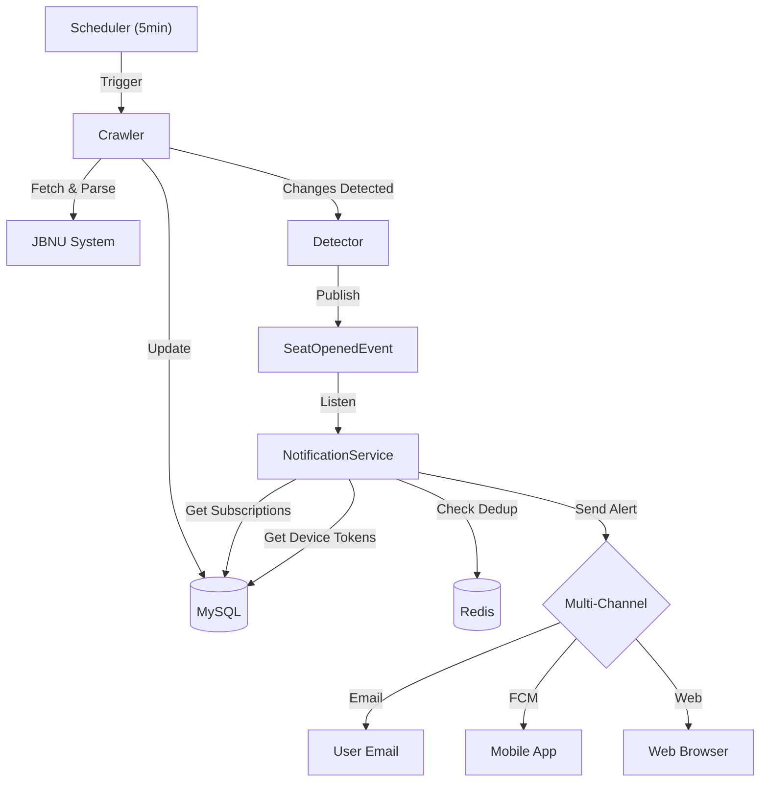

# JBNU 수강신청 알림 도우미 (Sugang Helper)

> **전북대학교 수강신청 빈자리 알림 서비스**
>
> 매번 새로고침할 필요 없이, 원하는 강의에 **여석(빈자리)**이 생기면 즉시 알림을 드립니다.

---

## 📖 프로젝트 개요 (Overview)

**Sugang Helper**는 수강신청 기간 동안 학생들의 고충을 해결하기 위해 개발되었습니다.
특정 강의의 정원과 신청 인원을 주기적으로 모니터링하고, **여석이 `0`에서 `1` 이상으로 변경되는 순간**을 감지하여 사용자에게 실시간 알림을 제공합니다.

## ✨ 핵심 기능 (Key Features)

### 1. 실시간 강의 모니터링

- **5분 주기**로 학교 서버(OASIS)를 크롤링하여 최신 수강 정보를 수집합니다.
- 불필요한 HTTP 헤더(`Cookie` 등)를 제거하고 필수 헤더만 사용하여 **요청 속도 최적화** 및 **서버 부하 최소화**를 구현했습니다.

### 2. 빈자리 발생 감지 (Smart Detection)

- 단순 데이터 변경이 아닌, **"신청 불가능" → "신청 가능"** 상태 변화를 정확히 감지합니다.
- `SeatOpenedEvent` 기반의 이벤트 처리를 통해 감지 로직과 알림 전송 로직을 분리했습니다.

### 3. 멀티 채널 실시간 알림

- **App Push (FCM)**: Firebase Cloud Messaging을 통해 모바일 기기로 즉시 푸시 알림을 발송합니다.
- **Web Push (VAPID)**: 브라우저 표준 프로토콜인 Web Push를 지원하여 PC/모바일 브라우저 알림을 제공합니다.
- **Email Notification**: Gmail SMTP를 사용하여 상세한 여석 변동 내역을 이메일로 전송합니다.

### 4. 중복 방지 (Dedup)

- **Redis**를 활용하여 동일한 변동 사항에 대해 중복 알림이 발송되지 않도록 제어합니다.
- 사용자 경험(UX)을 고려하여 알림 피로도를 최소화합니다.

### 5. 간편한 인증

- **Google OAuth2** 로그인을 통해 별도의 회원가입 없이 이용 가능합니다.
- JWT(Access Token + Refresh Token) 기반의 안전한 세션 관리 및 **Token Rotation**을 지원합니다.

### 6. API 자동 문서화 (Swagger/OpenAPI)

- **SpringDoc OpenAPI**를 통해 모든 API를 자동으로 문서화했습니다.
- 실제 JBNU 데이터 포맷을 반영한 상세한 **Example Value**를 제공하여 프론트엔드 개발 효율성을 높였습니다.
- `/swagger-ui/index.html`을 통해 인터랙티브하게 API를 테스트할 수 있습니다.

---

## 🛠 기술 스택 (Tech Stack)

| 구분         | 기술 (Technology)                                                                                  | 설명 (Description)                                         |
| :----------- | :------------------------------------------------------------------------------------------------- | :--------------------------------------------------------- |
| **Backend**  |  | Java 21 기반의 견고한 애플리케이션 프레임워크              |
| **Database** |                     | 사용자, 강의, 구독 정보의 영속성 저장 관리                 |
| **Infra**    |                     | 인증 토큰(Refresh), 알림 중복 방지(Dedup)를 위한 캐시 서버 |
| **Auth**     |          | 편리하고 안전한 소셜 로그인 시스템                         |
| **Crawler**  |                                                | 빠르고 효율적인 XML 응답 파싱 및 데이터 추출               |
| **Docs**     |               | SpringDoc 기반의 대화형 API 명세서 (Swagger UI)            |

---

## 🏗 아키텍처 흐름 (Architecture Flow)

1.  **Scheduler**: 설정된 크론 주기(5분)에 맞춰 크롤링 작업을 트리거합니다.
2.  **Crawler**: 최적화된 HTTP 요청으로 수강 데이터를 가져와 파싱하고 DB를 업데이트합니다.
3.  **Detector**: 이전 데이터와 비교하여 **여석 발생(0 → 1+)** 여부를 판단합니다.
4.  **Notifier**: 감지된 이벤트를 처리하여 구독자에게 알림을 발송합니다 (Redis로 중복 필터링).

---

## 💾 데이터 모델 (Data Model)

- **User**: 사용자 기본 정보 (`email`, `name`, `role`)
- **Course**: 강의 정보 (`courseKey`, `name`, `professor`, `capacity`, `current`, `lastCrawledAt`)
- **Subscription**: 사용자별 알림 구독 내역 (`userId`, `courseKey`, `isActive`)
- **UserDevice**: 알림 수신용 기기 정보 (`userId`, `type`, `token`, `p256dh`, `auth`)
- **NotificationHistory**: 알림 발송 기록 (`userId`, `courseKey`, `title`, `message`, `channel`)
