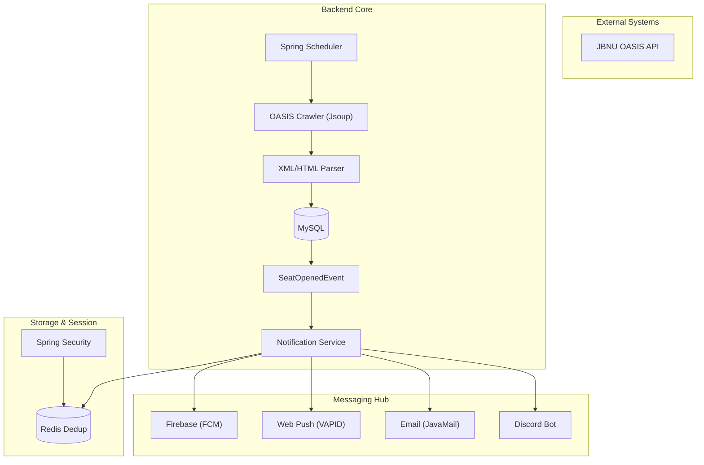

# 🚀 줍줍 (zup-zup) Backend

**줍줍: 실시간 여석 감지 및 멀티 채널 알림 서버**

  
  
  
  
  

---

## 💎 핵심 가치 (Core Values)

- **🛡️ Reliability**: Redis 기반 중복 알림 방지 및 크롤러 중복 실행 방지 로직을 통한 데이터 무결성 확보
- **📡 Scalability**: 비동기 이벤트 기반 아키텍처를 통한 멀티 채널(FCM/Email/Discord) 확장성
- **⚡ Efficiency**: 학기 전환 대응 최적화 및 실시간 시스템 모니터링 관리 도구 제공

---

## 🏗️ 시스템 아키텍처 (Architecture)

---

## �️ 기술 스택 (Tech Stack)

### 🧱 Framework & Language

- **Java 21 LTS**, **Spring Boot 3.5.x**
- **Spring Security** (OAuth2, JWT with Refresh Token Rotation)

### 💾 Data & Persistence

- **MySQL 8.0**, **Spring Data JPA**, **QueryDSL**
- **Redis** (Notification Dedup & Session Storage)
- **Flyway** (Database Version Control)

### 📢 Communication & Messaging

- **Firebase Admin SDK** (FCM)
- **WebPush (VAPID)**
- **JavaMail** (SMTP)
- **Discord Bot API**

---

## 📚 주요 기능 구현 (Key Implementation)

### 🔍 실시간 강의 수집 및 지능형 매핑 엔진

- **Jsoup 크롤링**: `AtomicBoolean` 제어로 중복 실행을 원천 차단한 안정적인 수집 엔진
- **지능형 학과 매핑**: 100여 개의 별칭 사전과 다단계 정규화 로직을 통한 학과 매핑 정확도 100% 달성
- **시간 범위 검색**: `dayOfWeek + startTime + endTime` 기반의 정밀 필터링 (QueryDSL 최적화)

### 🚀 비동기 멀티 채널 알림
... (중략) ...
---

## 📂 프로젝트 구조 (Structure)
... (중략) ...
---

## 📚 관련 문서 (Docs)

- 📜 **[릴리스 노트 (v1.3.1)](./docs/feature-updates.md)**
- 🛠️ **[트러블슈팅 로그](./docs/troubleshooting.md)**
