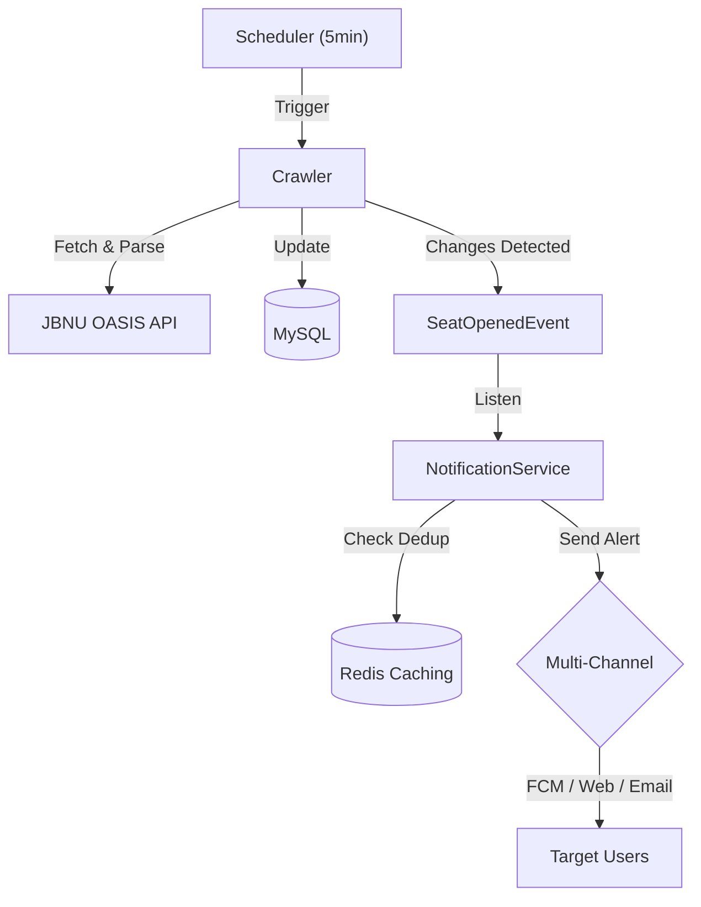

# JBNU 수강신청 빈자리 알림 (Sugang Helper)


> **"수강신청 빈자리, 이제 알림으로 확인하세요."**
> 전북대학교 수강신청 시스템을 모니터링하여 여석 발생 시 멀티 채널(FCM, Web, Email)로 알림을 전송하는 서비스입니다.

---

## 📖 프로젝트 개요 (Overview)

수강신청 기간의 반복적인 수동 조회 과정을 자동화합니다. 강의 데이터를 주기적으로 확인하여 **여석 발생(0 -> 1+)** 시점을 감지하고 알림을 보냅니다. 대규모 알림 발송 시의 성능 최적화와 Redis를 이용한 중복 알림 방지를 핵심적으로 구현했습니다.

---

## 🏗 아키텍처 (Architecture)



---

## 🚀 트러블슈팅 (Troubleshooting)

핵심적인 기술적 도전과 해결 과정입니다. 상세 내용은 [Troubleshooting Log](docs/troubleshooting.md)에서 확인할 수 있습니다.

### 1. 대규모 알림 발송 성능 최적화 (N+1 문제)

- **문제**: 특정 과목 여석 발생 시 수천 명의 구독자 정보를 개별 조회하며 발생하는 DB 병목 현상.
- **해결**: ID 리스트 기반의 **배치 조회(`IN` 절)**를 도입하여 쿼리 수를 단 3개로 고정, 발송 성능을 **약 80% 개선**.

### 2. Redis 기반 중복 알림 방지 (Dedup)

- **문제**: 짧은 크롤링 주기와 시스템 시차로 인해 동일 여석에 대해 중복 알림이 발송되는 UX 저하.
- **해결**: **Redis**를 활용해 과목별 발송 이력을 10분간 유지하는 Deduplication 메커니즘을 구축하여 알림 피로도 최소화.

### 3. 비동기(@Async) 로직의 테스트 신뢰성 확보

- **문제**: 알림 발송의 비동기 특성으로 인해 통합 테스트 검증 시점이 불확실해지는 비결정성 문제.
- **해결**: 테스트 전용 `SyncTaskExecutor` 설정을 도입하여 비동기 로직을 동기적으로 검증함으로써 **테스트 신뢰도 100% 달성**.

### 4. DB 초기화 시 세션 자동 정리 (401 mapping)

- **문제**: DB 초기화 후 기존 세션 사용자의 요청이 404로 반환되어 프론트엔드에서 로그아웃 처리가 안 되는 현상.
- **해결**: 유저 미발견 시 **401(Unauthorized)**을 반환하도록 표준화하여 프론트엔드의 자동 로그아웃 및 보안 신뢰성 강화.

### 5. 예약어(Year) 충돌 및 동적 쿼리 고도화

- **문제**: SQL 예약어 `YEAR`를 필드명으로 사용하여 발생한 쿼리 오류 및 복잡한 상세 검색(요일/교시) 구현의 어려움.
- **해결**: 필드명을 `academicYear`로 변경하여 예약어 충돌을 방지하고, **QueryDSL** 조인 쿼리를 통해 1:N 관계인 수업 시간표 필터링을 완벽하게 구현.

---

## ✨ 핵심 기능 (Core Features)

- **고급 강좌 검색 (Advanced Search)**: QueryDSL을 사용하여 연도, 학기, 이수구분, 학과, 성적평가방식, 수업방식, 강의언어, 요일/교시 등 모든 조건에 대한 동적 필터링 및 통합 검색 지원.
- **정밀 모니터링 & 파싱**: Jsoup 기반 XML 파싱 엔진 고도화. CSV 데이터와 XML 헤더를 100% 동기화하여 수강대상, 교양영역구분 등 모든 메타데이터를 누락 없이 수집.
- **구조화된 수업 시간표**: 텍스트 형태의 수업 시간을 `CourseSchedule` 엔티티(1:N)로 분리하여 요일 및 교시별 독립적인 검색 및 관리 지원.
- **과목 공석 변동 이력 조회**: 특정 과목의 공석 변동 이력을 조회하여 사용자가 과거 데이터를 기반으로 수강신청 전략을 세울 수 있도록 지원.
- **다양한 Enum 적용**: 데이터 일관성을 위해 이수구분, 성적평가 등 7가지 핵심 필드를 Enum 타입으로 전환하여 안전한 데이터 핸들링 보장.
- **멀티 채널 스마트 알림**: FCM(앱), Web Push(브라우저), Email(SMTP)을 통한 즉각적인 정보 알림 및 중복 방지 로직.
- **보안 인증**: Google OAuth2 및 JWT(Refresh Token Rotation) 기반의 안전한 세션 관리.

---

## 🛠 주요 기술적 고도화 (Technical Highlights)

본 프로젝트의 최근 업데이트를 통해 다음과 같은 기술적 개선이 이루어졌습니다.

### 1. QueryDSL 기반 동적 쿼리 엔진

단순 검색을 넘어 실시간으로 변하는 수강신청 상황에 대응하기 위해 QueryDSL을 도입했습니다.

- **수업 시간 Join 검색**: 1:N 관계인 `CourseSchedule` 테이블과 Join하여 '월요일 3-A 교시'와 같은 특정 시간대 강좌를 효율적으로 필터링합니다.
- **통합 검색 조건**: 복잡한 `BooleanBuilder` 로직을 통해 과목코드, 과목명, 교수명을 아우르는 통합 검색 기능을 제공합니다.

### 2. 데이터 구조 최적화 및 강좌 식별 개선

- **Enum 리팩토링**: 7가지 핵심 도메인 필드를 Enum으로 전환하여 코드 레벨의 타입 안정성을 확보하고 DB 인덱싱 효율을 높였습니다.
- **CourseKey 가독성 향상**: 기존 학수번호 중심의 식별자에서 **`과목코드-과목명-교수이름`** 형식의 가독성 높은 새로운 식별 체계로 변경하여 정밀한 강좌 추적이 가능해졌습니다.

### 3. XML/CSV 데이터 매핑 정합성 확보

- 전북대 수강 관리 시스템의 XML 헤더와 실제 다운로드 가능한 CSV 데이터 간의 미세한 명칭 차이를 분석하여 100% 일치하는 파싱 로직을 구축했습니다. (수강대상, 교양영역구분 등 누락 방지)

---

## 📂 프로젝트 구조 (Project Structure)

```text
src/main/java/bhoon/sugang_helper/
├── common/             # 공통 유틸리티, 예외 처리, 보안 설정
│   ├── config/         # Spring Configuration (Security, Redis, Swagger)
│   ├── error/          # 전역 에러 핸들러 및 ErrorCode 정의
│   ├── response/       # 공통 응답 포맷 (CommonResponse)
│   └── util/           # 보안 및 기타 유틸리티
├── domain/             # 도메인 기반 비즈니스 로직
│   ├── auth/           # OAuth2 인증 및 토큰 관리
│   ├── course/         # 강좌 정보 조회 및 크롤링 엔진
│   ├── notification/   # 알림 발송 멀티 채널 로직
│   ├── subscription/   # 유저 강좌 구독 관리
│   └── user/           # 사용자 프로필 및 기기(Device) 관리
└── SugangHelperApplication.java
```

---

## 🛠 기술 스택 (Tech Stack)

- **Backend**: Java 21 LTS, Spring Boot 3.5
- **Database**: MySQL 8.0, Redis (캐시 및 중복 제거)
- **Auth**: Google OAuth2, JWT
- **Communication**: Firebase Admin SDK, WebPush VAPID, JavaMail
- **Infra**: Docker, Docker Compose

---

## 🔧 실행 방법 (Setup)

### 1. 서비스 실행

별도의 DB 설치 없이 **Docker Compose**를 통해 즉시 시스템 전체를 실행할 수 있습니다.

```bash
# 전체 환경 실행 (MySQL, Redis 포함)
docker-compose up -d
```

### 2. 테스트 연동

기본적인 단위 테스트는 즉시 실행 가능하며, 통합 테스트(manual 태그)는 별도의 환경 변수 설정으로 실행할 수 있습니다.

```bash
# 기본 테스트 실행 (약 6초)
./gradlew test

# 수동 통합 테스트 실행 (JBNU_API_URL 설정 필요)
./gradlew manualTest
```
