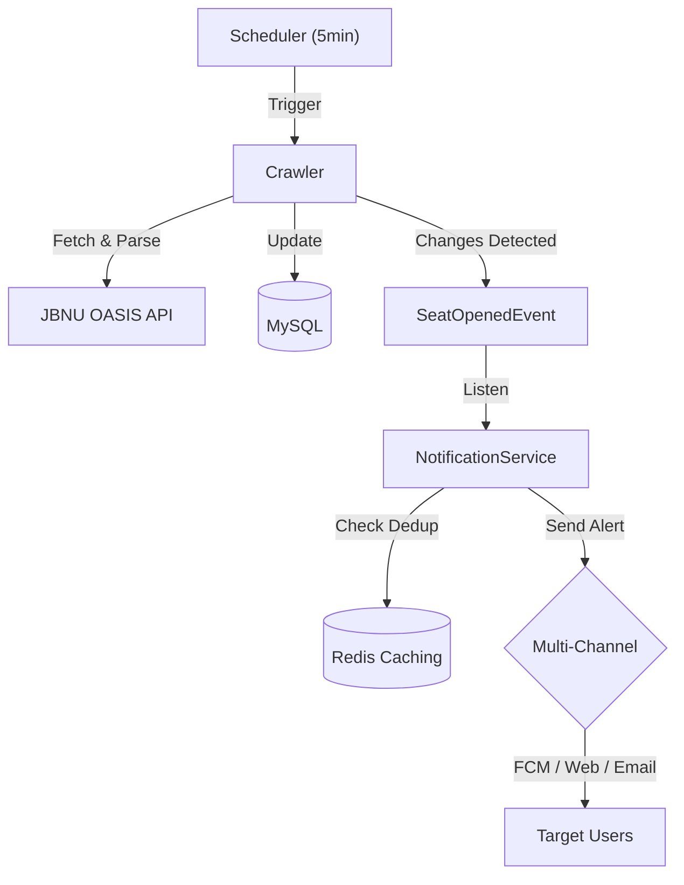

# JBNU 수강신청 빈자리 알림 (Sugang Helper)


> **"수강신청 빈자리, 이제 알림으로 확인하세요."**
> 전북대학교 수강신청 시스템을 모니터링하여 여석 발생 시 멀티 채널(FCM, Web, Email)로 알림을 전송하는 서비스입니다.

---

## 📖 프로젝트 개요 (Overview)

수강신청 기간의 반복적인 수동 조회 과정을 자동화합니다. 강의 데이터를 주기적으로 확인하여 **여석 발생(0 -> 1+)** 시점을 감지하고 알림을 보냅니다. 대규모 알림 발송 시의 성능 최적화와 Redis를 이용한 중복 알림 방지를 핵심적으로 구현했습니다.

---

## 🏗 아키텍처 (Architecture)



---

## 🚀 트러블슈팅 (Troubleshooting)

핵심적인 기술적 도전과 해결 과정입니다. 상세 내용은 [Troubleshooting Log](docs/troubleshooting.md)에서 확인할 수 있습니다.

### 1. 401 Unauthorized 및 세션 안정화

- **해결**: 세션 타임아웃 및 JWT 만료 시간을 **2시간**으로 연장하고, 토큰 재발급 시 세션 속성을 즉시 갱신하여 인증 정합성을 확보함.

### 2. 대규모 알림 발송 성능 최적화 (N+1 문제)

- **해결**: ID 리스트 기반의 **배치 조회(`IN` 절)**를 도입하여 쿼리 수를 단 3개로 고정, 발송 성능을 **약 80% 개선**.

### 3. Redis 기반 중복 알림 방지 (Dedup)

- **해결**: Redis를 활용해 과목별 발송 이력을 10분간 유지하는 Deduplication 메커니즘을 구축하여 알림 피로도 최소화.

### 4. BFF 아키텍처 전환 (Security Isolation)

- **해결**: Spring Session Redis를 도입하여 토큰을 서버 세션에 격리하고, 브라우저에는 HttpOnly 세션 쿠키만 발급하는 BFF 패턴으로 보안성 강화.

---

## ✨ 핵심 기능 (Core Features)

- **고급 강좌 검색 (Advanced Search)**: QueryDSL을 사용하여 연도, 학기, 이수구분, 학과 등 모든 조건에 대한 정밀 동적 필터링 지원. `대상학년`을 Enum화하여 조회 안정성을 높였으며, 찜한 강의 필터링 기능 통합.
- **고가용성 크롤링 엔진 (High-Reliability Crawler)**: 대용량 XML 응답(7MB+)을 누락 없이 수신하며, 개별 트랜잭션 분리 및 중복 실행 방지 로직(AtomicBoolean)을 통해 DB 락 경합 문제를 해결하고 안정적인 데이터 동기화 보장.
- **실시간 스마트 알림**: FCM(앱), Web Push(브라우저), Email(SMTP), **Discord DM**을 통한 즉각적인 정보 알림.
- **예비 수강 바구니 (Wishlist)**: 사용자별 관심 강좌 찜 기능 및 과목별 알림 구독 기능.
- **구조화된 수업 시간표**: 수업 시간을 엔티티화하여 요일/교시별 검색 및 시간표 생성/관리 지원.
- **기기 관리 및 Self-Healing**: 유저별 기기(Web/App) 별칭 관리 및 알림 발송 실패(404/410) 시 **자동 기기 삭제**로 데이터 정합성 유지.
- **보안 인증**: Google OAuth2 및 JWT(Refresh Token Rotation) 기반의 안전한 세션 관리.

---

## 📂 프로젝트 구조 (Project Structure)

```text
src/main/java/bhoon/sugang_helper/
├── common/             # 공통 유틸리티, 예외 처리, 보안 설정
├── domain/             # 도메인 기반 비즈니스 로직
│   ├── auth/           # OAuth2 인증 및 토큰 관리
│   ├── admin/          # 관리자 대시보드 및 알림 테스트 API
│   ├── course/         # 강좌 정보 조회 및 크롤링 엔진
│   ├── notification/   # 알림 발송 멀티 채널 로직
│   ├── subscription/   # 유저 강좌 구독 관리
│   ├── timetable/      # 수업 시간표 관리
│   └── user/           # 사용자 프로필 및 기기 관리
└── SugangHelperApplication.java
```

---

## 🛠 기술 스택 (Tech Stack)

- **Backend**: Java 21 LTS, Spring Boot 3.5
- **Database**: MySQL 8.0, Redis (캐시 및 중복 제거)
- **Auth**: Google OAuth2, JWT
- **Communication**: Firebase Admin SDK, WebPush VAPID, JavaMail (SMTP), **Discord Bot**
- **Infra**: Docker, Docker Compose

---

## 📊 성능 테스트 (Performance Testing)

본 프로젝트는 대규모 트래픽 폭증 상황에서의 안정성을 보장하기 위해 **k6** 기반의 성능 테스트 환경을 구축했습니다.

### 1. 테스트 시나리오

- **Smoke Test**: 모든 API 엔드포인트 생존 확인 (`smoke-test.js`)
- **Extreme Load**: 최대 **1,000 VUs** 규모의 스트레스/스파이크 테스트 (`advanced-stress-test.js`, `auth-spike-test.js`)
- **Integrated Flow**: 실제 유저 행동 양식(로그인-검색-찜-시간표-구독-내역조회) 재현 (`integrated-user-flow.js`, 500 VUs)
- **Admin Heavy**: 크롤링 트리거, 전역 통계 등 시스템 자원 집중 소모 작업 (`admin-heavy-ops.js`)
- **Notification Stress**: 알림 발송 엔진 스트레스 테스트 (`notification-stress-test.js`)

### 2. 실행 방법

k6가 사전에 설치되어 있어야 하며, `server` 디렉터리에서 실행합니다.

```bash
# 1. 통합 유저 시나리오 검증 (1회 반복)
k6 run scripts/k6/integrated-user-flow.js --iterations 1 --vus 1

# 2. 알림 발송 엔진 스트레스 테스트 (관리자 권한 필요)
k6 run -e ADMIN_TOKEN=<ADMIN_TOKEN> -e TEST_EMAIL=<TARGET_EMAIL> scripts/k6/notification-stress-test.js

# 3. 어드민 고부하 작업 테스트
k6 run -e ADMIN_TOKEN=<ADMIN_TOKEN> scripts/k6/admin-heavy-ops.js
```

### 3. 테스트 결과 (Summary)

로컬 환경에서의 기초 Smoke Test 결과입니다.

| 메트릭            | 결과 (Results) | 기준 (Threshold) | 판정          |
| :---------------- | :------------- | :--------------- | :------------ |
| **Success Rate**  | 100% (Error 0) | > 99%            | **PASS**      |
| **Avg Resp Time** | 13.55ms        | -                | **Excellent** |
| **P95 Resp Time** | 25.22ms        | < 300ms          | **PASS**      |

### 4. 상세 전략

상세한 부하 모델링 및 분석 결과는 [k6 성능 테스트 전략 문서](docs/k6-performance-strategy.md)를 참조하세요.

---

## 🔧 실행 방법 (Setup)

별도의 DB 설치 없이 **Docker Compose**를 통해 즉시 시스템 전체를 실행할 수 있습니다.

```bash
docker-compose up -d
```

### ⚙️ 환경 변수 설정 (Environment Variables)

`.env` 파일 또는 환경 변수로 다음 값을 설정해야 합니다.

```env
# Discord Bot
DISCORD_BOT_TOKEN=<YOUR_BOT_TOKEN>
DISCORD_CLIENT_ID=<YOUR_CLIENT_ID>
DISCORD_CLIENT_SECRET=<YOUR_CLIENT_SECRET>
```

> **Note**: DB 스키마는 **Flyway**를 통해 자동으로 마이그레이션됩니다. (`V2__expand_channel_column.sql` 포함)

---

## API 변경 사항 (v1.1)

### 강의 검색 페이징 (Pagination)

- **Endpoint**: `GET /api/v1/courses`
- **Response**: `Slice<CourseResponse>` 구조로 변경되어 무한 스크롤에 최적화된 데이터를 반환합니다.
