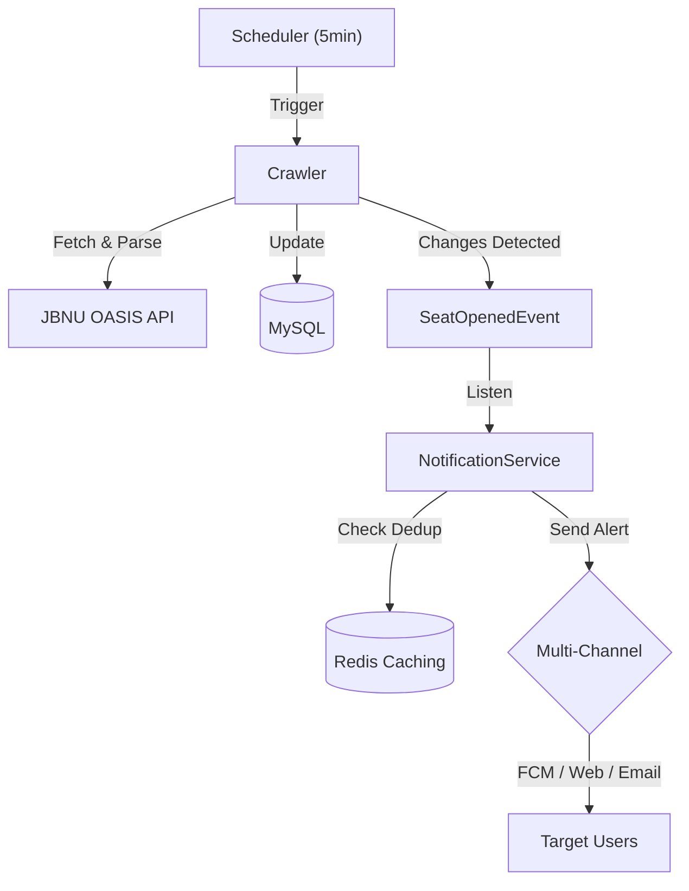

# JBNU 수강신청 빈자리 알림 (Sugang Helper)


> **"수강신청 빈자리, 이제 알림으로 확인하세요."**
> 전북대학교 수강신청 시스템을 모니터링하여 여석 발생 시 멀티 채널(FCM, Web, Email)로 알림을 전송하는 서비스입니다.

---

## 📖 프로젝트 개요 (Overview)

수강신청 기간의 반복적인 수동 조회 과정을 자동화합니다. 강의 데이터를 주기적으로 확인하여 **여석 발생(0 -> 1+)** 시점을 감지하고 알림을 보냅니다. 대규모 알림 발송 시의 성능 최적화와 Redis를 이용한 중복 알림 방지를 핵심적으로 구현했습니다.

---

## 🏗 아키텍처 (Architecture)



---

## 🚀 트러블슈팅 (Troubleshooting)

핵심적인 기술적 도전과 해결 과정입니다. 상세 내용은 [Troubleshooting Log](docs/troubleshooting.md)에서 확인할 수 있습니다.

### 1. 대규모 알림 발송 성능 최적화 (N+1 문제)

- **문제**: 특정 과목 여석 발생 시 수천 명의 구독자 정보를 개별 조회하며 발생하는 DB 병목 현상.
- **해결**: ID 리스트 기반의 **배치 조회(`IN` 절)**를 도입하여 쿼리 수를 단 3개로 고정, 발송 성능을 **약 80% 개선**.

### 2. Redis 기반 중복 알림 방지 (Dedup)

- **문제**: 짧은 크롤링 주기와 시스템 시차로 인해 동일 여석에 대해 중복 알림이 발송되는 UX 저하.
- **해결**: **Redis**를 활용해 과목별 발송 이력을 10분간 유지하는 Deduplication 메커니즘을 구축하여 알림 피로도 최소화.

### 3. 비동기(@Async) 로직의 테스트 신뢰성 확보

- **문제**: 알림 발송의 비동기 특성으로 인해 통합 테스트 검증 시점이 불확실해지는 비결정성 문제.
- **해결**: 테스트 전용 `SyncTaskExecutor` 설정을 도입하여 비동기 로직을 동기적으로 검증함으로써 **테스트 신뢰도 100% 달성**.

---

## ✨ 핵심 기능 (Core Features)

- **정밀 모니터링**: 5분 단위 자동 크롤링 및 Jsoup 기반의 효율적인 XML 데이터 파싱.
- **스마트 알림**: FCM(앱), Web Push(브라우저), Email(SMTP)을 통한 즉각적인 정보 알림.
- **동적 구독 관리**: 학수번호/과목코드 기반의 검색 및 실시간 구독/취소 기능.
- **보안 인증**: Google OAuth2 로그인 및 JWT(Refresh Token Rotation) 기반의 안전한 세션 관리.

---

## 🛠 기술 스택 (Tech Stack)

- **Backend**: Java 21 LTS, Spring Boot 3.5
- **Database**: MySQL 8.0, Redis (캐시 및 중복 제거)
- **Auth**: Google OAuth2, JWT
- **Communication**: Firebase Admin SDK, WebPush VAPID, JavaMail
- **Infra**: Docker, Docker Compose

---

## 🔧 실행 방법 (Setup)

### 1. 서비스 실행

별도의 DB 설치 없이 **Docker Compose**를 통해 즉시 시스템 전체를 실행할 수 있습니다.

```bash
# 전체 환경 실행 (MySQL, Redis 포함)
docker-compose up -d
```

### 2. 테스트 연동

핵심 비즈니스 로직에 대해 작성된 통합 테스트를 실행해볼 수 있습니다.

```bash
./gradlew test
```

---

## 📂 관련 문서 (Documentation)

- 📝 [기술 의사결정 및 트러블슈팅 상세](docs/troubleshooting.md)
